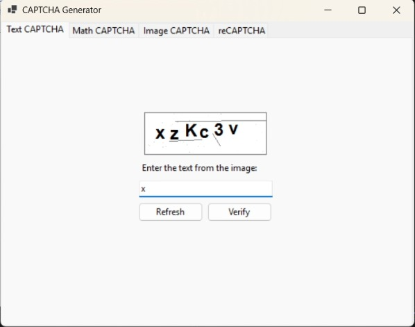

# 🔐 CAPTCHA Validator – C# Windows Forms Application

## 📄 Project Description

This is a C# Windows Forms application designed to demonstrate various CAPTCHA types for human verification and bot prevention. The application showcases four distinct CAPTCHA methods and allows users to refresh the challenge with a simple click, all within an intuitive graphical interface.

## ✨ Features

- **Text CAPTCHA**  
  Displays a distorted alphanumeric code that users must enter correctly.

- **Image CAPTCHA**  
  Shows an image-based challenge where the user must recognize certain objects.

- **Math-Based CAPTCHA**  
  Generates a random arithmetic question (e.g., `7 + 4`) that users must solve.

- **ReCAPTCHA Checkbox (Simulated)**  
  A mock version of the "I’m not a robot" checkbox, representing a basic bot-check mechanism.

- **Refresh Option**  
  Each CAPTCHA type includes a **refresh** button to generate a new challenge.

- **Simple UI**  
  Clean and straightforward interface for easy usability and testing.

## 👥 Team Members

- **Ahmed Ehab Mohamed Rashad** – 221101026  
- **Mazen Ehab Fathy Samaha** – 221101055  
- **Khaled El-Saeid Hamed Zahran** – 221101039

## 🔄 How It Works

1. User selects a CAPTCHA type from the interface.
2. The system generates a random challenge based on the selected type.
3. The user attempts to solve the CAPTCHA and submits their response.
4. The system validates the input and provides feedback.
5. A **Refresh** button allows the user to request a new challenge at any time.

## 🛠️ Technologies Used

- **C#**
- **Windows Forms (WinForms)**
- **GDI+ (for drawing CAPTCHA text/images)**
- **.NET Framework**

## 🖼️ Project Snapshot

  

## 🎥 Project Demo

[Download the Demo Video](Assets/CaptchaDemo.mp4)

## 🚧 Limitations & Future Enhancements

- Simulated ReCAPTCHA checkbox – not linked to Google’s actual ReCAPTCHA service.
- Limited complexity in image and text distortion techniques.
- Future improvements may include:
  - Google ReCAPTCHA v2/v3 integration
  - Audio CAPTCHA support
  - Enhanced visual effects (noise, rotation)
  - Using different random images for image captcha
